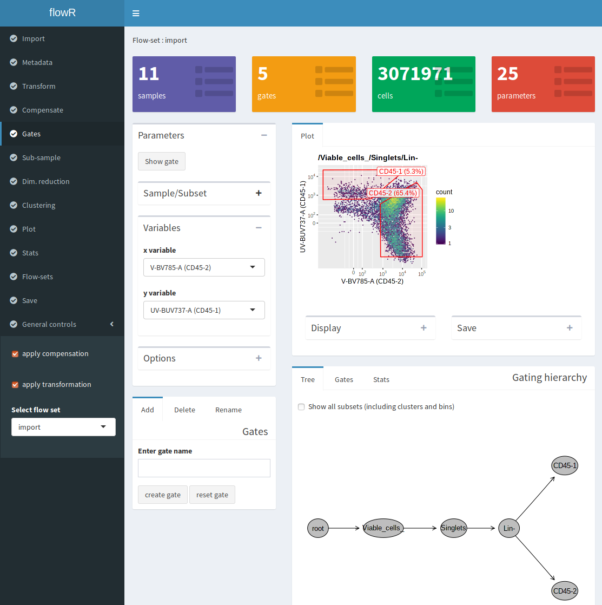

```{r setup, include=FALSE}
knitr::opts_chunk$set(echo = TRUE)
```

<script src="./my_script.js"></script>


<div class = "blue">
- my first idea
- my second idea
</div>


<a onclick="togglebis('foo');">Show-Hide</a>
<div id = "foo1" class="content">

<center>

</center>

</div>
	

# Import data

To load data, click on **browse** to select and import files. Imported files will be displayed on the right panel. Select one or multiple files and click on **load** to create a collection of samples, an object that we will call a **flowSet** in the following. The name of the flowSet is "Import" by default. 
The different types of data that can be used to create a flowSet are detailed below.

## Example dataset

An flowSet containing CyTOF data and predefined gates can be imported directly using the **Import example dataset** button. The original data is from *Bodenmiller et al*. This data was also used in the tutorial on multuparametric data analysis available here. See the **quick tutorial** for a brief tour of flowR functionnalities using this dataset.

## FCS files

Multiple FCS files can be imported to build a flowSet. Files selected in the table on the right pannel will be used to build the flowSet. Note that flow parameters and spillover matrix will be imported from the first FCS file only and applied to the entire flowSet.

## FlowJO workspace

*FlowR* allows to import FlowJO .wsp workspace files along with corresponding FCS files. The FlowJO worksapce file and the FCS files should first be imported using the **browse** button. On the right pannel, select only the .wsp file and the name of the sample group that will be used to create the flowSet. Only FCS files that have been imported (i.e that appear in the table on the right pannel) and that are part of the sample group will be used to create the flowSet. Click on the **load** button to build the flowSet.

## Text files (.txt or .csv)

A flowSet can be created from a single text file. The text file should be organized as a table with tab separated columns. Each line should correspond to single cell and each column should correspond to a single cell variable with the first line containing the names of the different variables. Numeric variables will be used as flow parameters. Note that factor or character variables will be used as cell metadata. If the data contains a column named 'name', it will be used to distinguish different samples.

## Previous analysis

You can import and load previous analysis done with *flowR* and saved as .Rda file (see the **FlowSets** section for more detailed information about saving a single or multiple flowSets).

# Metadata

Metadata refers to the information about the different samples in the flowSet. This information should be detailed enough to allow efficient sharing, re-use or reproduction of the data. In *flowR*, metadata can be used to filter, group and compare samples later during the analysis.
Sample metadata is displayed as a table in the **Metadata** tab. The table column "name" contains the names of the different samples in the flowSet. The different ways to edit sample metadata using *flowR* are detailed below.

## Enter metadata manually

Metadata can be edited manually. To do so, click on **add column**, enter a metadata column name and edit table entries individually by double-clicking on cells in the table.

## Import metadata from a external file

Sample metadata can be loaded from a external file (text or excel format supported). The imported table should have names matching those of the flowSet samples in its first column.

## Retrieve metadata from FCS kewords

If you have built the flowSet from FCS files, you can retrieve relevant information stored as as **keywords**. To do so, select a keyword in the drop-down slection menu on the right pannel and click on **Add keywords**. 

# Transform

In the **Transform** tab, we can see a table with all the parameters (observables) that have been measured for each sample in the flowSet. This table displays in particular the name of each parameter along with its description. This description is retieved automatically from FCS files but can be also be edited manually using the **Edit** tab. The data that we are dealing with has been generated by a CyTOF instrument. As such, we need to transfom most observables using the 'asinh' function. Select all variables except 'Time' and 'event_length', then select "asinh" from the drop-down menu in the **Transform** tab and click on the **apply to selected channels** button. The effect on the asinh transformation can be appreciated on the histogram displayed on the right pannel. So far, transformation  

# Compensation

Mass cytometry data usually display limited spillover between channels. We can check spillover between channels in the **Compensate** tab. The spillover matrix is displayed on the left pannel. It is automatically retrieved from the FCS file of the first sample in the flowSet. Here, no compensation has been applied so the spillover matrix is the identity matrix with zeros everywhere except for ones on its diagonal. Clicking on the matrix will display a 2D plot on the right pannel allowing to appreciate the spillover between the selected parameters. By convention, we use the signal in the channel corresponding to the emitting fluorophore as the y-axis parameter and the signal in other channel as the x-axis parameter.
